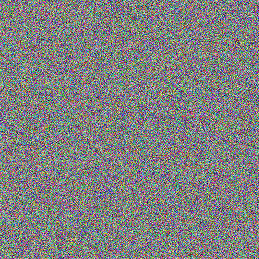
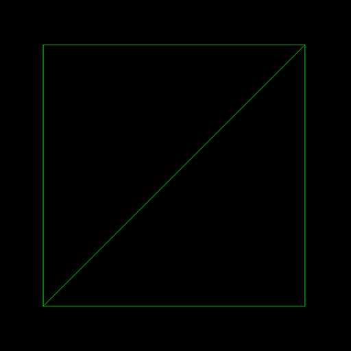
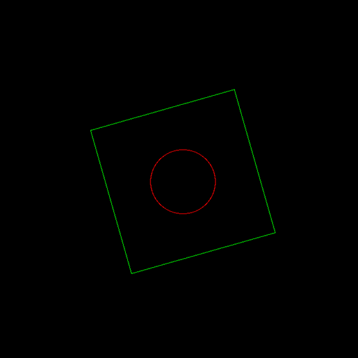
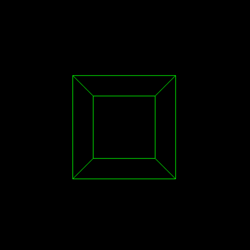
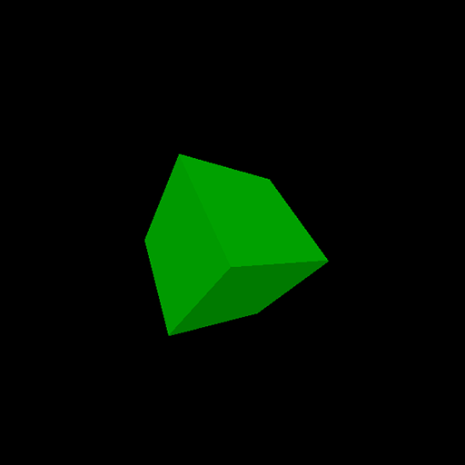

# Примеры базовых графических алгоритмов
Перечень демо-проектов с реализацией базовых графических алгоритмов применямых в растеризации. От точек до полигонального меша.

1) Точки

   
   
2) Линии

   
   
3) Вращение точек

   
   
4) Проекция точек

    
    
5) Полигональный рендеринг
    
    
    
6) Растеризатор с шейдерным конвейером (_не реализовано_)

Код писался и тестировался при помощи следующего набора инструментов
 - CLion (IDE)
 - MinGW или MSVC (Компиляция и сборка)

Вы можете открыть данный проект при помощи IDE с поддержкой CMake (CLion, Visual Studio 2019) и собрать его, 
либо сгенерировать файлы проекта для подходящей IDE (данный вариант не проверялся).

